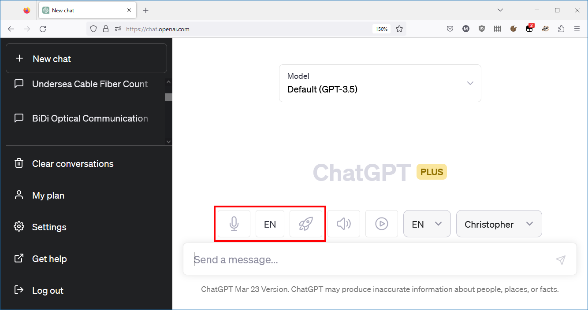
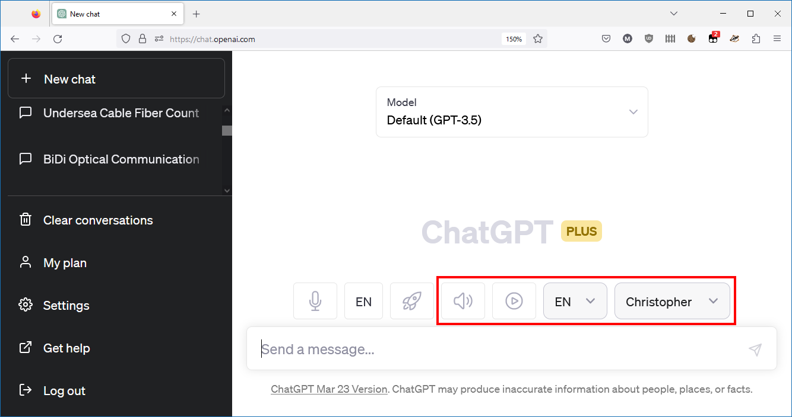

# MJakubec's Userscripts

## Overview

This repository contains a collection of Tampermonkey utility scripts suitable for various web page automation tasks.

In the sections below each particular script is described with usage and installation steps required to run it in your browser.

## General Installation Requirements

These scripts conform to the userscript specification available in a documentation of the **[Tampermonkey](https://www.tampermonkey.net)** web browser extension. It is possible that these scripts would be usable also in the other web browser extensions (such as Greasemonkey), but I haven't specifically tested them to be sure they will be.

To be able to run these scripts, at first you have to install the **[Tampermonkey](https://www.tampermonkey.net)** extension which is available for all mainstream web browsers as:
* [Google Chrome extension](https://chrome.google.com/webstore/detail/tampermonkey/dhdgffkkebhmkfjojejmpbldmpobfkfo)
* [Mozilla Firefox extension](https://addons.mozilla.org/en-US/firefox/addon/tampermonkey/)
* [Microsoft Edge extension](https://microsoftedge.microsoft.com/addons/detail/iikmkjmpaadaobahmlepeloendndfphd)
* [Safari extension](https://apps.apple.com/us/app/tampermonkey/id1482490089)
* [Opera Next extension](https://addons.opera.com/en/extensions/details/tampermonkey-beta/)

## Userscript installation and usage

In the following sections I'll provide more details about features, installation and usage of each particular script.

### ChatGPT Speech-to-Text

#### How it works

This userscript integrates ChatGPT web user interface with a speech recognition service of Microsoft Azure. It allows to easily pronounce your prompt into a microphone and it will magically transcribe it into a text prompt ready to be submitted to ChatGPT. 

#### Installation

To install the the ChatGPT Speech-to-Text usercript, you can simply click on this link:

[https://github.com/MJakubec/UserScripts/raw/main/ChatGpt/SpeechToText/ChatGptSpeechToText.user.js](https://github.com/MJakubec/UserScripts/raw/main/ChatGpt/SpeechToText/ChatGptSpeechToText.user.js)

After that, the Tampermonkey extension automatically intercepts the request and prompts you for a consent to install the userscript into your browser.

#### Configuration

Userscript configuration consists of these settings:

* __speechServiceRegionId__: Identifies a particular datacenter where the Speech resource is installed.
* __speechServiceAccessKey__: Authenticates every speech transcription request coming from the script to the Microsoft Cognitive Services.
* __silenceBlockCount__: Defines a minimum length of silence specified in a number of sample blocks. Each sample block has a length of 128 samples. After a specified length of silence the recording will stop and a speech record will be automatically submitted for a speech transcription.
* __intensityThreshold__: Allows to adjust a threshold of sound intensity when the speech recording will be initiated automatically.
* __delayedChunkCount__ - Defines a delay of audio stream in a number of sample blocks. Each sample block has a length of 128 samples. It allows a reliable detection of start of speech without missing the samples at the beginning of the audio recording.

All the above specified parameters are configurable through the Tampermonkey extension user interface. If you edit the userscript and select the __Storage__ tab of the Edit userscript view, you can easily change all of the configuration parameters at once.

Prior to its use, you have to provide at least the configuration parameters which allow the connection to a Speech resource of Microsoft Cognitive Services running in a Microsoft Azure cloud.

For more information how to install the Speech resource and acquire the parameters for Speech resource access, consult the [Speech SDK documentation](https://learn.microsoft.com/en-us/azure/cognitive-services/speech-service/get-started-speech-to-text?tabs=windows%2Cterminal&pivots=programming-language-rest).

#### Usage

If you successfully installed the userscript according to instructions specified above, after you log on into ChatGPT web application the userscript will be automatically injected into a page and three new buttons will be shown above the textbox of the prompt:

* __Microphone__: Allows to activate and deactivate listening mode.
* __Language__: Allows to change a language of your speech.
* __Auto-submit__: Allows to automatically submit the transcribed prompt.

To activate the listening mode you click on the **Microphone** button. Its icon changes color to red to indicate that your microfone is listening to your speech. If you want to deactivate the listening mode, click the button again.

To change the language of your speech you can repeatedly click on the Language button to select a language between English, Czech and German. Of course, it is possible to add more languages in the future.

To get a completely touchless experience, you can click on the **Auto-submit** button and your speech will be submitted immediately after receiving its transcription. To deactivate this function, click the button again.

### ChatGPT Text-to-Speech

#### How it works

This userscript integrates ChatGPT web user interface with a text-to-speech service of Microsoft Azure. It allows to have the ChatGPT answer to you with a voice of your choice. Note that only the regular text answers of ChatGPT are processed with text-to-speech. Outputs of code listings are ignored because there is simply no sense of reading them aloud.

#### Installation

To install the ChatGPT Text-to-Speech usercript, you can simply click on this link:

[https://github.com/MJakubec/UserScripts/raw/main/ChatGpt/TextToSpeech/ChatGptTextToSpeech.user.js](https://github.com/MJakubec/UserScripts/raw/main/ChatGpt/TextToSpeech/ChatGptTextToSpeech.user.js)

After that, the Tampermonkey extension automatically intercepts the request and prompts you for a consent to install the userscript into your browser.

#### Configuration
Userscript configuration consists of these settings:

* __speechServiceRegionId__: Identifies a particular datacenter where the Speech resource is installed.
* __speechServiceAccessKey__: Authenticates every speech transcription request coming from the script to the Microsoft Cognitive Services.
* __languages__: Defines a set of languages and their associated voices the user has selected through the user interface of the script. It is possible to add more languages here. Refer to the list of supported languages and voices available in the [Microsoft Speech SDK documentation](https://learn.microsoft.com/en-us/azure/cognitive-services/speech-service/language-support?tabs=tts).

All the above specified parameters are configurable through the Tampermonkey extension user interface. If you edit the userscript and select the __Storage__ tab of the Edit userscript view, you can easily change all of the configuration parameters at once.

Prior to its use, you have to provide at least the configuration parameters which allow the connection to a Speech resource of Microsoft Cognitive Services running in a Microsoft Azure cloud.

For more information how to install the Speech resource and acquire the parameters for Speech resource access, consult the [Speech SDK documentation](https://learn.microsoft.com/en-us/azure/cognitive-services/speech-service/get-started-text-to-speech?tabs=windows%2Cterminal&pivots=programming-language-rest).

#### Usage

If you successfully installed the userscript according to instructions specified above, after you log on into ChatGPT web application the userscript will be automatically injected into a page and four new controls will be shown above the textbox of the prompt:

* __Speaker__ button: Allows to manually start reading answers already available in a currently selected chat.
* __Auto-play__ button: Allows to automatically reading answers to be received during the active interaction with ChatGPT.
* __Language__ dropdown: Allows to quickly select an active language and its associated voice to be used in reading the next sentence aloud.
* __Voice__ dropdown: Allows to quickly select an active voice for the currently selected language. The list of available voices is download automatically from the Microsoft Cognitive Services API during the startup of the script. Last choice of voice is remembered for each available language and is automatically stored in the script configuration settings.

To start reading the answers aloud of currently selected chat you click on the **Speaker** button. Its icon changes color to red to indicate that the answers are read aloud. Currently read sentence of the ChatGPT answer is highlighted with green background. If you want to stop reading the answers immediately, click this button again.

To have automatically read the answers of ChatGPT aloud as they are received, you can click on the **Auto-play** button. After that, if you submit the prompt to ChatGPT and you get the answer, it will be read aloud immediately. To deactivate this mode, click the button again.

To change the language and/or voice of the reading you can select the Language from the appropriate dropdown. It is possible to add more languages by editing the script configuration as mentioned above.

